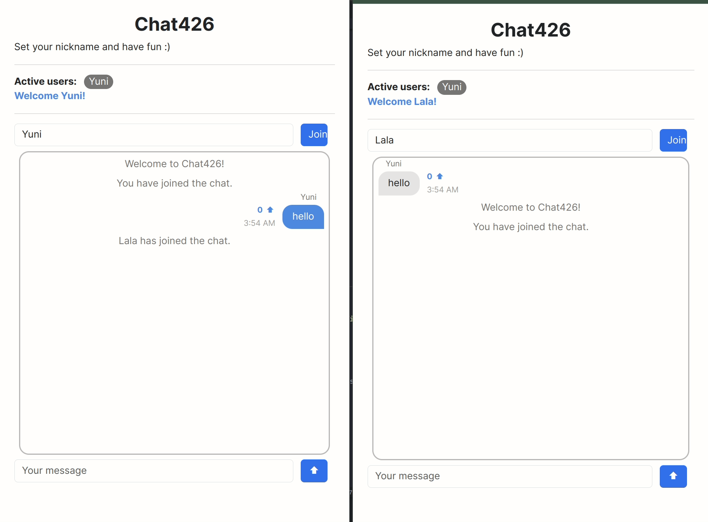

# Chat426

<p align='center'>
    
</p>

## How to Run

```
docker compose up --build
```

If you see the "permission denied while trying to connect to the Docker daemon socket at ..." error, run `sudo chown $USER /var/run/docker.sock` in the terminal (solution found from [this discussion thread](https://www.digitalocean.com/community/questions/how-to-fix-docker-got-permission-denied-while-trying-to-connect-to-the-docker-daemon-socket)).

## Description

Chat426 is a simple chatroom web application where multiple users can connect and communicate with each other. This app follows the microservices and event-bus design pattern on top of Socket.io for communication between browsers. There are three microservices:

#### Chatroom

The chatroom service handles the communication between browsers and a Socket.io server. This microservice is where the Socket.io server is created.

#### Moderator

The moderator service checks the chat message content and replaces it with “The message has been moderated.” if it contains profanity. "Profanity" in this project is a set of words drawn from [this list](https://github.com/coffee-and-fun/google-profanity-words/blob/main/data/en.txt).

#### Vote

Lastly, the vote service manages the voting feature of the app. Each user can upvote a message once, and all users can see who upvoted a message.

All data–user list, chat history, and vote history–are stored in MongoDB. So when a new user joins, they can see all the past chat history. The communication between microservices is handled by the event bus. The client directly fetches data from a microservice or uses Socket.io API to emit different events and data.

All services generate logs in the logs/combined.log file and send them to the console. Following event bus architecture requirement while using Socket.io API was challenging and interesting. This app could have been easily converted to a monolith design, but I enjoyed the learning experience.

Much more detailed description/report on the project can be found [here.](/Final%20Report.pdf)

## Data

To view or edit data stored in MongoDB, enter the MongoDB shell by running

```
mongosh -u admin -p secret
```

Here, `admin` and `secret` are simply an arbitrary credential specified in the `docker-compose.yml` file.

### View stored data

```
> db.<database_name>.find()
```

### Delete all content in database

```
> use <database_name>
> db.<database_name>.deleteMany({})
```

## Framework and Libraries Used

### Frontend

-   Svelte: utilized Svelte components, props, and store for a clean, reactive, and scalable (and pretty 😁) frontend.

### Backend

-   Express and Node.js
-   Morgan: logs incoming HTTP request
-   Winston: logs to the console and the `combined.log` file
-   MongoDB: stores active user list, chat history, and message vote history
-   Socket.io: responsible for real-time communication between web clients (browsers)
-   cors
-   nodemon

### Scalability

-   PM2: PM2 clones are employed for scalability. Each microservice have at least one clone.
-   Docker

## Demo Video

[Uploaded to my Google Drive](https://drive.google.com/file/d/1ctQ6r_gmwLX-GZZczxwsQquwekczIHx9/view?usp=sharing)

## Moving Forward...

Currently, Chat426 has the following key restrictions that differ from a typical chat application: (1) users can only send text (no image or video), (2) there is one central chatroom where all users are in, and (3) users can simply access the URL and start chatting.

Therefore, an exciting and natural extension of this project would be to allow users to (1) send other forms of data, (2) make new chatrooms and invite specific users, and (3) create an account and log in.
